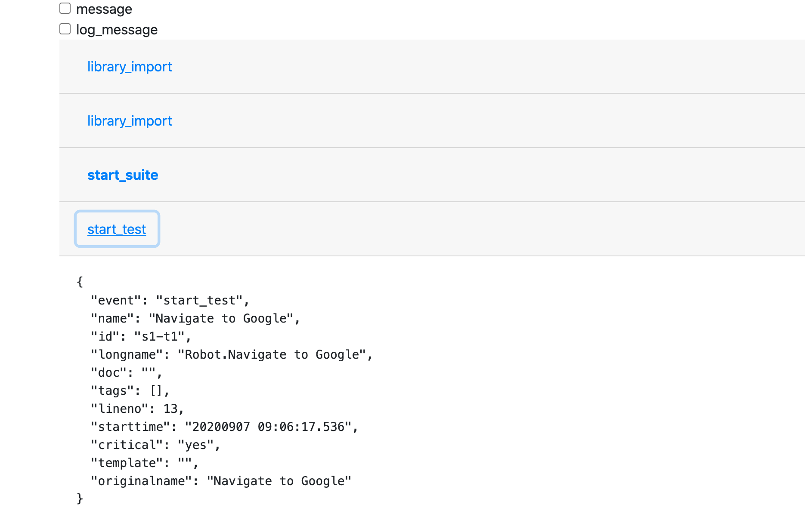

# robotframework-listener-api-events

Robot Framework listener for sending JSON formatted events
over websocket.

This solution can be used for live monitoring and debubbing of
events provided by Robot Framework listener API. Locally running
websocket server receives the event data as JSON and provides it
to websocket clients.

Initial use case is to provide easier means for debugging and studying the events and
the data available via listener API (version 2). An example web application receives
the data as JSON, parses it and provides an initial user interface. Some of the more
verbose events (`message`, `log_message`) can be hidden from the view.

# Installing and running

## Install Python dependencies

    pip install -r requirements.txt

## run websocket server on background

    python ListenerApi2Events.py &

## open [index.html](./index.html) in web brower, e.g.:

    open index.html

## Run Robot Framework with the listener

    robot --listener ListenerApi2Events.py ~/Robots/Simple/tasks/robot.robot

# Implementation notes

All methods by Listener API 2 are provided. Arguments are collected to single JSON object
where `"event"` matches the listener API method:

    "event": "end_suite",

Arguments of the methods (name, attrs, message, path) are added to the JSON object
depending on the availability:

    {
      "event": "output_file",
      "path": "/Users/user123/src/websocket/output.xml"
    }

    {
      "event": "start_keyword",
      "name": "BuiltIn.Log",
      "kwname": "Log",
      "libname": "BuiltIn",
      "doc": "Logs the given message with the given level.",
      "assign": [],
      "tags": [],
      "starttime": "20200906 23:26:48.209",
      "args": [
          "Hello!"
      ],
      "type": "Keyword"
    }

JSON data can be parsed on web application Javascript as follows:

    var jsondata = JSON.parse(event.data);

and accessed easily:

    if (jsondata.event == "start_suite") {
      button.classList.add("font-weight-bold");
    }

Using hard coded `ws://localhost:5678/` for now, change in the code if needed.

# References

Robot Framework listeners: https://robotframework.org/robotframework/latest/RobotFrameworkUserGuide.html#listener-interface

Listener API version 2: https://robotframework.org/robotframework/latest/RobotFrameworkUserGuide.html#listener-version-2

Based on the reference at https://github.com/mkorpela/robotframework-websocket
